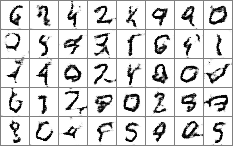

# GANs

This repository implements feedforward [Generative Adversarial Networks](https://arxiv.org/pdf/1406.2661v1.pdf) and an experimental form of recurrent GAN. It includes some of [the work done at OpenAI](https://arxiv.org/pdf/1606.03498v1.pdf) on GANs.

# Basic results

As a quick test, I trained a small GAN to produce MNIST digits. Here is the result:



I also built a deeper GAN for extracting features from face images. The results can be found in [MustacheMash](https://github.com/unixpickle/mustachemash)

# Recurrent GANs?

After a few different attempts, I still have not managed to get a recurrent GAN to produce reasonably English-sounding text. I will probably pick this up again in the future. Here, I will document some of the results I *have* seen while trying to generate text with a GAN.

**Random outputs.** Obviously, when the GAN first starts up, the generator produces random outputs. These outputs include plenty of non-ASCII characters, so I will not include them here.

**Homogeneous outputs.** Often, the generator will output a few letters constantly, ignoring most other characters. For example:

```
TTTTTTTTTTeTTTTTTTTNTTTTTITTHTTTTHTTTTTTeTTTTTTeTTTTTTTTTTTTTTTTTTTTTTTTTTTTTeTTTTeTTHTTTTTTTTTTTTTTTTTTeTTTTTTTTTTTTTTTTTTTTTTTeTTTTTTTeTTTTTTATTTTTT

eTTTTTTTTTTTTTTTTTTTTTTTTTTTTTlTTTTTTTTTTTTTTTTTTBTTTTTTTTTTTTTTTTTTTTTTTTTTTTTTTTTTTTTTTMTTTTTTTTTTTTTTTTTTTTTTTTTTTTTTeTTTTYTTTTeTTTTTTTBTTTTTTTTTTT
```

**Lots of spaces.** Occasionally, the generator learns to output way more spaces than are present in English text, resulting in something like this:

```
WhA   IIAto  tPI  A     EAP S   d B P   A    A  e HA  IRPJP   uI    I P P  P   n  IP o   A   AiHT    TA  P     P  n     P  PH t  P A  sY BA hP  R  A  

AP   IiP A    AP I  D  A    P     P cA E      A  n      A  Sh   A PIP  O hN  AIPI  Eeei aPA s PBPe P     lP  P PPAA    P  AK   h A H   AeHt e Iao  h o
```

**Starting with a capital.** Usually, the generator eventually learns to start its outputs without capital letters (since the samples all look that way). Outputs might look like so:

```
Tlnpsndywwwdpkddc.ndwnwwnywppvhwmsdalldwvpwwswlwwvwndwpddwatsnEntosswwdywInw fsswl.pwndds.pdx pllylw.fn.ob.â.swwbywwcdlwdwwvnnndwdwwph ddelnbsdwpnwpb

Iodrwwwnwdfb.o.nteodewwdstdwwevtkFpwdflnfrv\wslpnÇebddwwppbwwlvwdTpdwsnnopdbtynfBwwfdww.eywvnp.pvwOddtdklcnlwfnnwytnyP³ voppldywwwbv.ywdeldywcwwtbwlws
```

**Lots of dots.** This is a case wherein the generator collapses to output a few consonants and dots. Outputs look like so:

```
ht.......hh.....hhuh....hthuhh...uuhtt.ht.huht.thohhh..ehuhuht..thhthhthrhh..thhu.u.hhutt...hnhh...htuht..hthht...hhhuut..hhuu..hahhhtrt..hhht...hhhhu

tt.....hhh....hhhut.tthhhut.t.tuuuu....huhh...thhhhh....huhrrh.tthhttn.ttuhth .huhh..hhhhuht..hthht.hhtauht..hhhhhr..hhht..t.uthhu..tthh ..htthh. u.hh
```

**Homogeneous with 1st capital.** Enough said:

```
Aaaaaaaaaaaaaaaaaaaaaaaaaaaaaaaaaaaaaaaaaaaaaaaaaaaaaaaaaaaaaaaaaaaaaaaaaaaaaaaaaaaaaaaaaaaaaaaaaaaaaaaaaaaaaaaaaaaaaaaaaaaaaaaaaaaaaaaaaaaaaaaaaaaaaa

Aaaaaaaaaaaaaaaaaaaaaaaakaaaaaaaaaaaaaaaaaaaaaaaaaaaaaaaaaaaaaaaaaaaaaaaaaaaaaaaaaaaaaaaaaaaaaaaaaaaaaaaaaaaaaaaaaaaaaaaaaaaaaaaaaaaaaaaaaaaaaaaaaaaaa

GAaaaaaaaaaaaaaaaaaaaaaaiaaaaaaaaaaaaaaaaaaaaaaaaaaaaaaaaaaaaaaaaaaaaaaaaaaaaaaaaaaaaaaaaaaaaaaaaaaaaaaaaaaaaaaaaaaaaaaaaaaaaaaaaaaaaaaaaaaaaaaaaaaaaa
```
